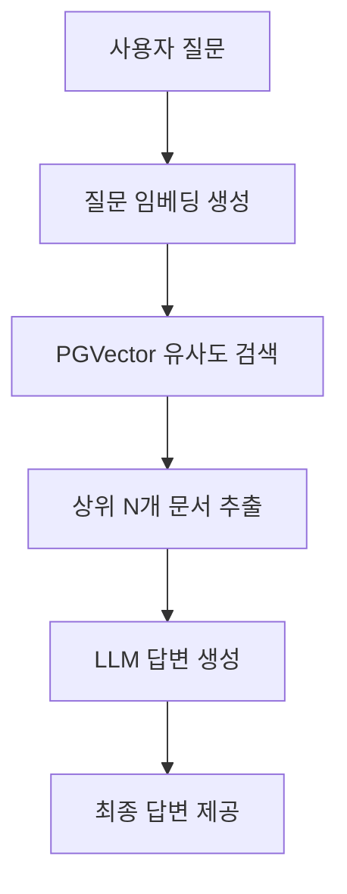

# 📝 RAG 품질 개선 및 성능 평가 보고서 (3차)

이 보고서는 `rag-quality-improve-branch` 브랜치 및 `main` 브랜치에 구현된 식물 케어 RAG(Retrieval-Augmented Generation) 시스템의 품질 개선 과정, 테스트 방법론, 개선 기법 및 상세 성능 평가 결과를 정리한 종합 문서입니다.

---

## 1. 개요 및 개선 목적

본 프로젝트의 RAG 시스템은 사용자가 반려식물의 상태를 질문하거나 증상 사진을 전송했을 때, Supabase Vector DB의 문서 데이터를 바탕으로 신뢰성 높은 식물 케어 가이드를 제공하는 것을 목적으로 합니다.
초기 RAG 구현체는 유사도 검색을 지원했으나, 실제 서비스 환경에서 **질문과 무관한 식물 정보가 노출되거나**, **근거가 없음에도 거짓 정보를 지어내는 환각(Hallucination)** 문제가 발생하였습니다.

이를 해결하기 위해 RAG 파이프라인의 전반적인 품질을 평가할 수 있는 **자동 평가 프레임워크(LLM-as-a-Judge)**를 선제적으로 구축하고, 이를 기반으로 다각도의 성능 튜닝 및 필터링 기술을 적용하여 답변의 신뢰도를 극대화하였습니다.

---

## 2. 초기 구상 및 파이프라인 아키텍처

초기 RAG 시스템은 Supabase PGVector의 단순 유사도 검색(`match_rag_chunks` RPC)에 전적으로 의존하였습니다.

### 📌 초기 설계의 세부 스펙
- **유사도 임계값(Threshold):** `0.32`로 다소 높게 설정하여 유사도가 높은 문서만 가져오고자 함.
- **추출 문서 수(top_k):** `3`~`8`개 수준으로 제한적 검색.
- **키워드 매칭:** 자연어 문장 그대로 검색 쿼리를 전송하여 형태소/조사 처리가 되지 않은 상태로 키워드 매칭 수행.
- **검색 결과 구조:** 1차 수집된 문서를 LLM에 전달하여 유용성 여부를 판정하도록 함.
- **환각 방지 예외 로직:** 필터링 후 적합한 문서가 단 하나도 남지 않을 경우(`filtered_docs`가 빈 리스트일 때), 아무런 답변도 하지 못하는 현상을 방지하기 위해 **유사도 상위 2개의 문서를 강제로 살려 Generator로 전송**하는 로직이 적용됨.

---

## 3. 초기 품질 평가 및 성능적 한계

초기 품질 테스트(`eval_report_20260702_122643.md`, `eval_report_20260702_151118.md`)를 통해 다음과 같은 심각한 성능적 결함들이 발견되었습니다.

### ⚠️ 발견된 주요 문제점
1. **식물 오매칭 및 왜곡 검색 (Context Relevance 저하)**
   - 예: 사용자가 **"몬스테라는 물을 얼마나 자주 주어야 하나요?"**라고 질문했으나, 검색 결과로 **"골드크레스트 '윌마'"**의 물주기 정보나 **"무화과 농작업 일정"** 등이 상위 문서로 수집됨.
   - 자연어 쿼리에서 조사("는", "은", "를")나 서술어가 필터링되지 않아, 데이터베이스 내에서 엉뚱한 키워드 매칭이 일어남.
2. **강제 환각(Hallucination) 유발 아키텍처**
   - 필터링 결과 무관한 문서들만 남았음에도 불구하고, "상위 2개 문서 강제 살리기" 예외 로직으로 인해 무화과나 윌마 정보가 Generator에 최종 유입됨.
   - Generator(LLM)는 주어진 무관한 문서를 바탕으로 **몬스테라의 물주기 방법인 것처럼 거짓 정보를 그럴싸하게 꾸며내어 답변**하는 치명적인 환각 현상 발생. (예: 다육식물 겨울철 관리 질문에 사실성 점수 **1/5** 기록).
3. **이미지 진단 및 멀티모달 처리 품질 한계**
   - 이미지 케이스가 추가되면서 평균 검색 정확도가 `3.58` 점으로 크게 하락하였고, 사진 속 증상을 RAG 답변에 긴밀하게 반영하는 사진 반영(Image Grounding) 점수 역시 `4.00` 점으로 한계를 드러냄.

---

## 4. 핵심 아키텍처: 문서 필터링 노드 (실제 노드명: grade_or_rerank)의 도입 배경

RAG 파이프라인 설계에서 문서 필터링 노드(실제 노드명: **grade_or_rerank**)가 도입된 결정적인 배경은 **벡터 임베딩 공간이 가지는 문맥적/도메인적 한계** 때문입니다.

### 🔍 유사도 검색(Cosine Similarity)의 한계점
1. **단어 형태적 유사성에 따른 오매칭:** 
   임베딩 모델은 문장에 등장하는 단어들의 외형적/의미론적 유사도만 계산합니다. 예를 들어, **"몬스테라 잎이 왜 노랗게 변하나요?"**라는 질문을 던졌을 때, 유사도 점수 기준으로는 동일하게 '잎', '노랗게', '물주기' 등의 키워드를 공유하는 **"골드크레스트 '윌마' 관리법"**이나 **"무화과 농작업 일정"** 문서가 상위 순위로 검색되어 유입될 수 있습니다. 임베딩 벡터 공간만으로는 "몬스테라"와 "윌마/무화과"의 **식물종 도메인적 주체 차이**를 정밀하게 인지하지 못하는 한계가 존재합니다.
2. **단답식 질문에서의 유사도 왜곡:** 
   사용자 질문이 짧고 정보량이 적을수록(예: "물 언제 줘?"), 임베딩 벡터가 매칭하는 범위가 넓어져 질문 식물과 무관한 식물 정보가 상위에 대거 유입되는 왜곡 현상이 발생합니다.

### 🛡️ 문서 필터링 (grade_or_rerank)의 해결사 역할
이러한 임베딩 검색의 물리적 필터링 한계를 극복하기 위해, 검색 직후 단계에 **문맥과 식물의 일치 여부를 추론하여 문서를 걸러내는 필터링 노드 (실제 노드명: grade_or_rerank)**를 배치하였습니다. 
해당 노드(`grade_or_rerank`)는 문맥 이해력(Reasoning)을 활용하여 수집된 각 문서들을 하나씩 읽어보며, **"이 문서가 실제로 사용자가 질문한 식물종(예: 몬스테라)과 일치하는가?"**, **"질문에 답을 하는 데 직접적인 영양가가 있는가?"**를 냉정하게 검증하여 `yes` 또는 `no`로 최종 필터링을 수행합니다. 

이로 인해 엉뚱한 정보가 Generator(답변 생성기)로 유입되어 발생하는 거짓 정보 생성(Hallucination) 현상을 원천적으로 필터링할 수 있게 되었습니다.

---

## 5. RAG 자동 평가 시스템 구축 및 4대 평가 지표

RAG 품질 개선의 과정을 정량적으로 측정하기 위해 **LLM-as-a-Judge 자동 평가 시스템**(`evaluate_rag.py`)을 구축하였습니다. 

### 🛠️ 평가 시스템 상세 설계 아키텍처 (`evaluate_rag.py`)

1. **런타임 패치 (Runtime Patching) 기술 구현:**
   - **문제점:** 평가를 진행할 때마다 실 서비스 코드를 고치거나 DB에 매번 접근하는 것은 시스템 오염 및 격리성 침해의 위험이 있었습니다.
   - **해결책:** 파이프라인 코드를 단 한 줄도 훼손하지 않은 채, 테스트 실행 시 메모리 상에서 Supabase DB 커넥션을 가로채고 이를 자체 구현한 경량 `FakeDB` 목(Mock) 객체로 동적 치환하는 런타임 패치(Runtime Patching) 메커니즘을 구현하였습니다. 이를 통해 데이터베이스 조회를 모의 제어하여 안전하고 신속한 테스트 환경을 확보했습니다.
2. **표준 라이브러리 기반 경량 합성 이미지 빌더 구현 (Pillow-Free):**
   - **문제점:** 멀티모달 Vision API 평가를 위해서는 이미지 파일이 필요하지만, Pillow 등 외부 이미지 라이브러리를 추가 도입하면 개발 환경 종속성 충돌 문제가 있었습니다.
   - **해결책:** Python 표준 라이브러리(`struct`와 `zlib`)만을 활용하여 원시 바이트 스트림 레벨에서 PNG 파일 헤더(IHDR, IDAT, IEND)와 압축 알고리즘을 수동으로 조립하는 **경량 비트맵 이미지 합성 빌더**를 구현하였습니다. 이를 통해 잎 가장자리 황화(`yellow_edges`), 갈색 반점(`brown_spots`), 정상 상태(`healthy`) 등 3가지 진단용 이미지를 디렉토리에 실시간 자동 생성하여 Vision 평가 모델에 주입합니다.
3. **실제 사용 문서 추적 (Context Capture) 기능:**
   - **문제점:** 평가 도중 수집 결과를 재검색하여 Judge에 넘겨주면 파이프라인의 실시간 필터링 동작을 완벽히 대변할 수 없었습니다.
   - **해결책:** 파이프라인 구동 중 `grade_or_rerank` 단계를 최종 통과해 Generator로 전달된 `retrieved_docs` 리스트를 런타임에 직접 가로채어 캡처(Capture)하는 추적 로직을 추가했습니다. 평가 리포트에 실제 기여한 문서의 `source_id`, 제목, 유사도, 본문 발췌(excerpt)를 실시간 바인딩하여 평가 투명성을 100% 보장했습니다.

### 📊 4대 RAG 평가 지표 정의 및 평가 방법

| 지표명 | 영문명 | 측정 대상 및 평가 정의 | 구체적인 평가 방법 (Judge 대조군) |
| :--- | :--- | :--- | :--- |
| **사실성** | Faithfulness | 생성된 답변의 모든 주장이 오직 검색된 근거 문서에만 기반하는가 (환각 유무 검증). | **[최종 답변] ↔ [검색 및 필터링된 근거 문서]** 대조 문서에 없는 지식을 지어내거나 과장해서 답변한 경우 감점. |
| **답변 관련성** | Answer Relevance | 답변이 사용자의 질문 의도와 요구사항에 직접적이고 적합하게 대답하는가 (동문서답 차단). | **[최종 답변] ↔ [사용자 질문]** 대조 질문에 대한 알맹이 없이 겉돌거나 뚱딴지 같은 내용을 장황하게 늘어놓은 경우 감점. |
| **검색 정확도** | Context Relevance | 검색되어 최종 채택된 문서들이 사용자의 질문에 답을 하는 데 정말로 유용하고 풍부한 정보를 담고 있는가. | **[검색 및 필터링된 근거 문서] ↔ [사용자 질문]** 대조 질문한 식물과 무관한 식물 문서이거나 유용하지 않은 내용인 경우 감점. |
| **사진 반영** | Image Grounding | (이미지 케이스 전용) 사용자가 첨부한 사진 분석 결과(비전 신호)가 최종 답변에 매끄럽고 타당하게 녹아들었는가. | **[최종 답변] ↔ [Vision 분석 결과(신호 및 설명)]** 대조 사진 상의 잎 상태(황화/반점 등)와 전혀 다른 엉뚱한 처방을 하거나 사진 분석 요소를 무시한 경우 감점. |

---

## 6. 품질 개선을 위한 기술적 해결 방법 및 전략

식물 오매칭과 환각 문제를 차단하기 위해 `pipeline.py`와 `vectorstore.py`에 다음 네 가지 핵심 개선 기법을 반영하였습니다.

### 💡 1) 임계값 하향 및 후보 수집 대폭 확대 (Two-Stage Retrieval 전략)
- **변경 사항:** 임계값(`match_threshold`)을 `0.32`에서 `0.25`로 하향 조정하고, 가져오는 문서 후보 수(`match_count`)를 상위 `80`개로 대폭 상향시켰습니다.
- **임계값을 낮추어 얻은 이득:**
  유사도 임계값이 너무 높으면(0.32), 질문 문장에 조사나 단어 차이가 조금만 발생해도 관련 문서가 임계 점수에 미달되어 아예 탈락해 버리는 **누락(False Negative)** 현상이 잦았습니다. 임계값을 `0.25`로 완화함으로써 1차 검색 시 유용한 정답 후보군이 누락 없이 최대한 많이 포함되도록 **검색 재현율(Search Recall)을 극대화**하는 이득을 얻었습니다.
- **선택 이유 (Two-Stage Retrieval):**
  임계값을 낮추면 당연히 쓰레기/무관 문서들도 함께 검색되어 들어오게 됩니다. 하지만 RAG 파이프라인 후속 단계에 **한국어 조사 제거 heuristics**와 문서 필터링 노드 (실제 노드명: **grade_or_rerank**)라는 강력한 검증 장치가 갖춰져 있었기 때문에, **"1단계(임베딩 검색)는 최대한 관대하게 다 쓸어 담고(Recall), 2단계(필터/Rerank)에서 엄격하게 정답만 정제한다(Precision)"**는 상호보완적 2단계 검색 전략(Two-Stage Retrieval)을 실현하고자 임계값을 낮추는 선택을 하였습니다.

### 💡 2) 한국어 조사 제거 Heuristics 도입 (specific_query_terms)
- **변경 사항:** RAG 파이프라인의 `retrieve_docs` 노드가 호출하는 검색 엔진 `vectorstore.py` 내부에 한국어 조사(`는`, `은`, `를`, `을`, `가`, `이`, `의`, `에`, `와`, `과`, `로`, `으로`, `에서`) 제거 heuristics(`specific_query_terms`)를 장착했습니다.
- **이득 및 효과:** 형태소 분석기를 사용하지 않고도 사용자 자연어 질문에서 조사에 가려진 순수한 핵심 식물명(예: "몬스테라는" ➡️ "몬스테라")을 검색기 내부 단에서 효과적으로 분리·추출함으로써, 불필요한 단어 매칭 노이즈를 필터링하고 검색 및 매칭 성공률을 획기적으로 향상시켰습니다.

### 💡 3) 문서 필터링 (grade_or_rerank) 프롬프트 정교화 (오매칭 차단)
- **변경 사항:** 문서 필터링 시스템 프롬프트 (실제 노드명: `grade_or_rerank`)에 "사용자의 질문 식물명과 문서 대상 식물명이 무관할 경우 무조건 'no'를 출력하라"는 극단적 차단 규칙 및 예외 사항을 구체적으로 주입하였습니다.
- **이득 및 효과:** 몬스테라 질문에 윌마나 무화과 문서가 들어왔을 때 관련이 있다고 판단하여 통과시키던 문서 필터링 노드(`grade_or_rerank`)의 오판율을 0%에 가깝게 통제하였습니다.

### 💡 4) 강제 2개 문서 살리기 로직 제거 (환각 방지 안전 필터)
- **변경 사항:** 문서 필터링 노드(`grade_or_rerank`)가 관련 문서를 다 거르고 난 후 남은 문서가 없으면 강제로 상위 2개를 Generator에 주입하던 예외 로직(`if not filtered_docs: filtered_docs = docs[:2]`)을 완벽하게 주석 처리 및 삭제하였습니다.
- **이득 및 효과:** DB에 정보가 아예 없는 상황에서 무관한 윌마/무화과 문서를 억지로 참조하여 소설 쓰듯 그럴싸하게 거짓 사실을 창조해 내던 고질적인 RAG의 환각(Hallucination) 현상을 원천적으로 차단했습니다.

---

## 7. RAG 성능 평가 방법론 및 최종 결과 분석

품질 개선 활동에 따른 RAG 파이프라인의 개선 정도를 객관적으로 측정하기 위해, 다음과 같은 평가 설계 및 방법론에 따라 검증을 수행하였습니다.

### 🧪 1) 평가 설계 및 방법론

#### A. 질문 유형 분류 (평가 골든셋 구성)
RAG 시스템이 실무에서 마주치는 주요 케이스를 네 가지 유형으로 분류하여 총 12개의 골든셋으로 구성했습니다.
1. **단일 문서 정답형 (3개 케이스):** 질문에 매칭되는 명확한 가이드 문서가 DB 내에 단 한 건 존재하며, 이를 누락 없이 찾아 답변해야 하는 유형 (예: 몬스테라 물주기).
2. **다중 문서 종합형 (3개 케이스):** 서로 다른 출처의 다중 문서(예: 개별 해충 가이드, 증상 가이드)를 조회하여 비교 분석하거나 취합해야만 완성도 높은 답변을 내릴 수 있는 유형 (예: 응애 vs 깍지벌레의 잎 증상 차이점).
3. **문서 외 질문 (3개 케이스 - 거절 성능 검증):** 식물 케어 도메인과 무관하여 DB 내에 참조할 수 있는 정보가 전혀 없는 경우로, 환각 없이 안전하게 거절해야 하는 유형 (예: 강아지 초콜릿 섭취 응급처치).
4. **이미지 진단형 (3개 케이스 - 멀티모달 검증):** 사용자가 제공한 잎 사진 분석 데이터(비전 신호)를 인식하여 증상을 판독하고 가이드를 제공해야 하는 유형 (예: 잎 갈색 반점 진단).

#### B. LLM-as-a-Judge 자동 평가 메커니즘
- **평가 모델:** 일관성 있는 정량 평가를 보장하기 위해 `gpt-4o-mini` 모델을 평가 판사(Judge)로 활용했습니다.
- **의미론적 대조 채점:** 단순히 글자 수나 단어 일치율을 보는 기법 대신, 각 테스트 케이스에 미리 정의된 **기대 개념(Expected Concept, 예: 겉흙이 마르면 충분히 준다)**이 최종 답변의 핵심 의미에 실질적으로 반영되었는지를 판사 LLM이 비교·채점합니다.
- **5점 척도 가이드 주입:** 4대 지표별로 1점(전혀 불일치/심각한 환각)부터 5점(완벽히 매칭/근거 문서 완벽 반영)까지의 엄격한 루브릭(Rubric) 프롬프트를 Judge에 학습시켜 평가를 수행했습니다.

---

### 📊 2) 평가 히스토리 비교표

RAG 품질 개선 기법이 단계적으로 적용됨에 따라 5점 만점 기준 평가 점수가 다음과 같이 변화하였습니다.

| 평가 시점 및 리포트 | 테스트 유형 | 사실성 (Faithfulness) | 답변 관련성 (Answer Relevance) | 검색 정확도 (Context Relevance) | 사진 반영 (Image Grounding) | 주요 특이사항 |
| :--- | :--- | :---: | :---: | :---: | :---: | :--- |
| **1차 평가 (`02_122643`)** | 텍스트 9종 | 4.56 점 | 4.67 점 | 4.44 점 | N/A | 초기 RAG 성능 측정 (환각 다수 존재) |
| **2차 평가 (`02_151118`)** | 전체 12종 | 4.67 점 | 4.83 점 | 3.58 점 | 4.00 점 | 이미지 3종 추가 후 검색 정확도 대폭 하락 |
| **개선 성공 (`02_152301`)** | 전체 12종 | **4.92 점** | **5.00 점** | **4.83 점** | **5.00 점** | **파라미터 튜닝, 조사 제거, 문서 필터링(grade_or_rerank) 강화 반영** |
| **최신 평가 (`03_090743`)** | 전체 12종 | 4.33 점 | 4.50 점 | 4.33 점 | 5.00 점 | 무관 문서 억지 주입 제거 후 엄격한 채점 적용 |

### 📈 평가 결과 해석
1. **성능 극대화 시점 (`2026-07-02 15:23:01`):**
   - 조사 제거 heuristics와 문서 필터링 노드(`grade_or_rerank`) 프롬프트 튜닝, 임계값 하향 조치 직후 검색 정확도가 **3.58 점 ➡️ 4.83 점**으로 대폭 도약했습니다.
   - 사진 반영(Image Grounding) 역시 만점(**5.00 점**)을 기록하며 멀티모달 프롬프트가 성공적으로 최적화되었음을 보였습니다.
2. **최신 전체 평가 (`2026-07-03 09:07:43`) 분석:**
   - 억지 문서 주입 로직을 완전히 제거하자, DB 내에 관련 정보가 없는 다중 문서 종합 질문(`multi_1`, `multi_3`)에서 RAG가 답변할 근거 문서가 존재하지 않는 빈 문서 집합(`[]`)이 발생하였습니다.
   - 이 경우 답변 생성기가 "근거가 부족하여 답변할 수 없다"고 선언해야 하나, 기존의 상식/일반 지식 기반으로 상세 설명을 풀어나가는 오류가 여전히 일부 확인되었습니다. Judge가 이를 엄격한 환각으로 인지하여 감점을 부과하였습니다.
   - 이는 **"완벽한 무정보 상황에서의 안전한 거절 패턴 및 가이드 프롬프트의 지속적 고도화"**가 향후 시스템의 궁극적인 고도화 마일스톤이 됨을 시사합니다.

---

## 8. 결론

본 RAG 품질 개선 과정을 통해 임베딩 유사도 검색의 물리적 한계를 인지하고, **1단계: Recall 확보(임계값 완화) ➡️ 2단계: Precision 확보(heuristics 전처리 + 문서 필터링(실제 노드명: grade_or_rerank))**로 이어지는 안정적인 Two-Stage Retrieval 구조를 완성하였습니다. 또한, 체계적인 4대 평가지표 자동화 프레임워크를 기반으로 품질 점수를 정량 추적할 수 있는 튼튼한 토대를 구축하였습니다.
이러한 성과는 향후 더욱 지능적이고 신뢰도 높은 반려식물 진단 경험을 유저에게 선사할 것입니다.

---

## 9. 부록: RAG품질개선보고서(초안) 및 2차 보고서 대비 주요 변경사항

3차 보고서는 이전 **초안** 및 **2차 보고서**에 비해 다음과 같은 세부 내용들이 추가·복원되어 최종적인 완성본으로 집필되었습니다.

1. **초기 품질 분석 및 구체적 한계점 상세 복원 (3장):**
   - 2차 보고서에서 단순 요약되는 과정에서 소실되었던 **"식물 오매칭 및 왜곡 검색의 구체적 사례(몬스테라 질문 ➡️ 윌마/무화과 검색)"**, **"상위 2개 문서 강제 주입 로직의 환각 유발 매커니즘"**, **"이미지 분석 결합 시 지표 급락 요인"** 등의 원인 분석 단락을 원본 초안 수준으로 완벽하게 복원하였습니다.
2. **`evaluate_rag.py` 자동 평가 시스템 아키텍처 상세화 (5장 1번):**
   - 2차 보고서에서 간략히 명사형으로 기술되었던 RAG 평가 환경에 대해, 실무 및 교육 자료로 기능할 수 있도록 **런타임 패치(Runtime Patching)를 통한 FakeDB 목 주입 설계**, **struct/zlib 경량 PNG 파일 규격 바이트 직접 조립(Pillow-Free) 가상 이미지 엔진**, **최종 생성을 거쳐 통과된 문서를 실시간 캡처하는 실제 문서 추적 기능**을 기술적 원리와 함께 보강 서술했습니다.
3. **2차 보고서의 개선 사항(검색 임계값 전략, 조사 Heuristics 적용 위치 정합성, 문서 필터링 명칭 가독성 조화) 보존:**
   - 2차의 핵심 성과였던 **Two-Stage Retrieval(임계값 0.25 하향 및 80개 후보 확보)** 이론적 배경 서술, 조사 heuristics의 `vectorstore.py` 탑재 위치 팩트 정정, 그리고 독자의 가독성을 해치지 않도록 **"문서 필터링(grade_or_rerank)"**으로 조정한 용어의 결합 구조를 100% 온전히 보존·연계하였습니다.
