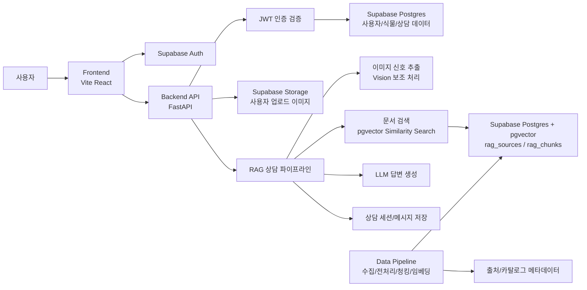
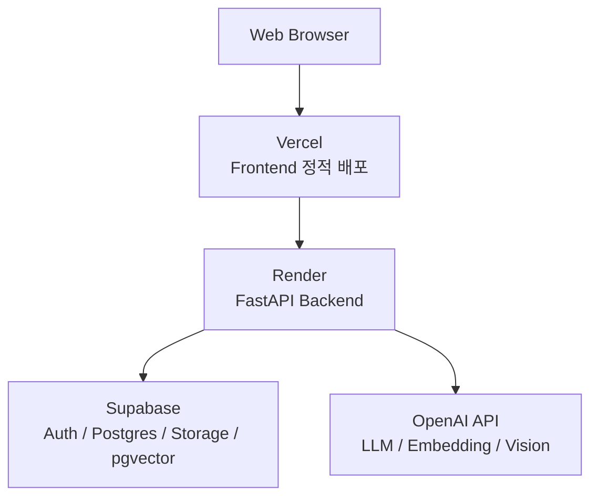
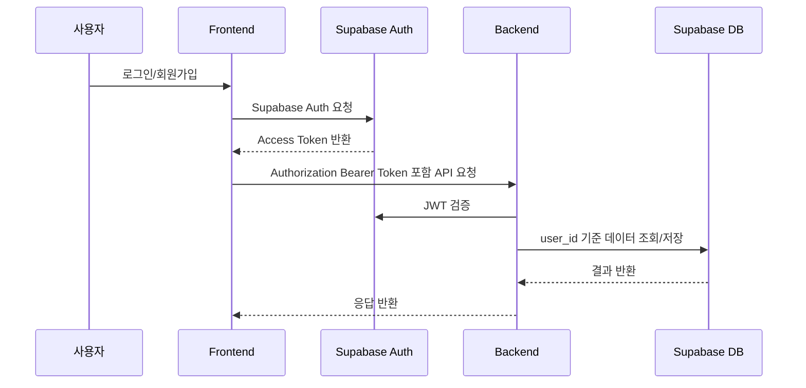
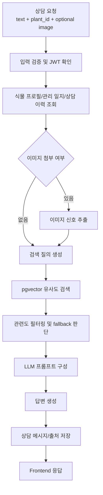

# Farmhani 시스템 아키텍처

## 1. 문서 목적

본 문서는 Farmhani 프로젝트의 시스템 아키텍처 문서이다. Farmhani는 사용자가 등록한 식물 정보, 사진, 관리 기록을 기반으로 공식 식물/작물 관리 문서를 검색하고, RAG 기반 LLM 상담을 제공하는 식물 관리 서비스이다.

시스템은 크게 Frontend, Backend, Data Pipeline, Supabase 인프라로 구성된다.

## 2. 전체 시스템 구성

## 3. 주요 구성 요소

| 영역 | 기술 | 역할 |
|---|---|---|
| Frontend | Vite, React, TypeScript | 사용자 화면, 로그인/회원가입, 식물 등록, 사진 업로드, AI 상담 UI |
| Backend | FastAPI, Pydantic | API 서버, 인증 검증, 사용자 데이터 처리, RAG 상담 실행 |
| Database | Supabase Postgres | 사용자, 식물, 관리 일지, 상담 세션, RAG 문서 메타데이터 저장 |
| Vector DB | Supabase Postgres + pgvector | RAG chunk embedding 저장 및 유사도 검색 |
| Auth | Supabase Auth | 회원가입, 로그인, JWT 발급 |
| Storage | Supabase Storage | 사용자 식물 사진 및 상담 첨부 이미지 저장 |
| LLM | OpenAI API | RAG 검색 결과와 사용자 맥락 기반 답변 생성 |
| Data Pipeline | Python scripts | 공공 데이터 수집, 정규화, 청킹, 임베딩, Supabase 적재 |
| Deployment | Vercel, Render, Supabase | Frontend, Backend, DB/Auth/Storage 배포 |

## 4. 배포 아키텍처

### 4.1 Frontend 배포

- 배포 위치: Vercel
- 프로젝트 Root Directory: `frontend`
- Build Command: `npm run build`
- Output Directory: `dist`
- 주요 환경변수:
  - `VITE_SUPABASE_URL`
  - `VITE_SUPABASE_ANON_KEY`
  - `VITE_BACKEND_URL`

### 4.2 Backend 배포

- 배포 위치: Render
- 실행 대상: `backend/app/main.py`
- ASGI app: `app.main:app`
- 주요 환경변수:
  - `DATABASE_URL`
  - `SUPABASE_URL`
  - `SUPABASE_ANON_KEY`
  - `SUPABASE_SERVICE_ROLE_KEY`
  - `OPENAI_API_KEY`

### 4.3 Supabase 역할

Supabase는 단순 인증 저장소가 아니라 다음 역할을 함께 담당한다.

- 사용자 인증: Supabase Auth
- 관계형 데이터: 사용자 식물, 관리 일지, 상담 세션, 상담 메시지
- 벡터 데이터: `rag_chunks.embedding` 기반 pgvector 검색
- 출처 메타데이터: `rag_sources`, `rag_chunks`
- 이미지 저장: 사용자 식물 사진, 상담 첨부 이미지

## 5. 사용자 인증 및 권한 흐름

Backend는 모든 사용자 데이터 요청에서 JWT를 검증하고, `user_id` 기준으로 식물, 사진, 상담 내역 접근 범위를 제한한다. Supabase service role key는 Backend 서버에서만 사용하며 Frontend에는 노출하지 않는다.

## 6. 주요 사용자 기능 흐름

### 6.1 식물 등록

1. 사용자가 Frontend에서 식물 이름, 품종, 위치, 광량 등 기본 정보를 입력한다.
2. 사진을 첨부한 경우 Frontend가 Backend 업로드 API를 호출한다.
3. Backend는 Supabase Storage에 이미지를 저장하고 `plant_photos` 또는 `plants.image_url`에 참조를 기록한다.
4. 식물 기본 정보는 `plants` 테이블에 사용자별로 저장된다.
5. 등록된 식물은 대시보드와 내 식물 페이지에 반영된다.

### 6.2 관리 일지 기록

1. 사용자가 물주기, 활력 상태, 잎/흙 상태, 메모를 입력한다.
2. Backend는 `care_logs`에 기록을 저장한다.
3. 이후 AI 상담 시 해당 식물의 최근 관리 이력이 사용자 맥락으로 함께 사용된다.

### 6.3 AI 상담

1. 사용자가 상담 메시지를 입력한다.
2. 사진을 첨부한 경우 이미지도 함께 Backend로 전달된다.
3. Backend는 사용자 JWT를 검증하고 식물 정보, 관리 일지, 이전 상담 맥락을 조회한다.
4. RAG 파이프라인이 질문을 정리하고 관련 공식 문서를 검색한다.
5. LLM이 검색된 문서와 사용자 맥락을 근거로 답변을 생성한다.
6. 답변과 참고 문서는 `chat_sessions`, `chat_messages`에 저장된다.
7. Frontend는 답변, 오늘의 할 일, 참고 문서를 사용자에게 표시한다.

## 7. RAG 상담 파이프라인

### 7.1 RAG 검색 기준

RAG 검색은 다음 정보를 조합해 질의를 만든다.

- 사용자 질문
- 선택된 식물 이름 및 품종
- 최근 관리 일지
- 첨부 이미지에서 추출한 관찰 신호
- 상담 모드: 전문가 상담 / 내 식물과 대화하기

검색 결과는 `rag_chunks`의 embedding 유사도와 메타데이터를 기준으로 가져오며, 출처는 `rag_sources`와 연결해 Frontend에 제공한다.

### 7.2 답변 생성 기준

LLM 답변은 다음 원칙을 따른다.

- 검색된 공식 문서가 있을 경우 해당 근거를 우선 사용한다.
- 근거가 부족하면 확정적으로 말하지 않고 추가 관찰 정보를 요청한다.
- 병해충, 농약, 방제 관련 표현은 확정 진단이나 직접 처방처럼 보이지 않도록 한다.
- 사용자 모드에 따라 전문가형 말투 또는 식물 대화형 말투로 응답한다.
- 답변은 사용자가 바로 실행할 수 있는 관리 행동을 포함한다.

## 8. 데이터 파이프라인 아키텍처

### 8.1 데이터 처리 단계

1. 수집: 농사로, NCPMS, AI Hub 샘플/라벨, 식물 카탈로그 등 프로젝트 목적에 맞는 자료를 수집한다.
2. 정규화: 출처별 필드명을 공통 스키마로 변환한다.
3. 청킹: RAG 검색에 적합하도록 문서를 작은 단위로 분할한다.
4. 메타데이터 부여: 제목, URL, 출처, 카테고리, 작물명, 키워드, 수집일을 포함한다.
5. 임베딩: 텍스트 chunk를 embedding vector로 변환한다.
6. 적재: `rag_sources`, `rag_chunks`에 저장한다.

### 8.2 RAG 관련 주요 테이블

| 테이블 | 역할 |
|---|---|
| `rag_sources` | 원본 문서 또는 데이터 출처 단위 메타데이터 |
| `rag_chunks` | 검색 가능한 텍스트 chunk, embedding, symptom keywords, metadata |
| `chat_sessions` | 사용자별/식물별 상담방 |
| `chat_messages` | 사용자 질문, AI 답변, 참고 문서 기록 |

## 9. Backend API 구조

| API 모듈 | 역할 |
|---|---|
| `backend/app/api/v1/plants.py` | 식물 등록, 조회, 수정, 관리 일지 처리 |
| `backend/app/api/v1/uploads.py` | 이미지 업로드, Storage 연동 |
| `backend/app/api/v1/chat.py` | AI 상담 요청, 상담 세션/메시지 처리 |
| `backend/app/api/v1/rag.py` | 공식 문서 검색 및 RAG 관련 API |
| `backend/app/api/v1/catalog.py` | 식물 품종 검색/자동완성 |

## 10. 핵심 구현 코드 위치

| 구분 | 경로 | 설명 |
|---|---|---|
| RAG 파이프라인 | `backend/app/services/rag/pipeline.py` | 상담 흐름, 프롬프트 구성, LLM 호출 |
| 벡터 검색 | `backend/app/services/rag/vectorstore.py` | Supabase pgvector 검색 |
| 이미지 보조 처리 | `backend/app/services/rag/vision.py` | 업로드 이미지 기반 관찰 신호 추출 |
| 상담 API | `backend/app/api/v1/chat.py` | Frontend 상담 요청 처리 |
| RAG 검색 API | `backend/app/api/v1/rag.py` | 공식 문서 검색 |
| 데이터 청킹 | `data/scripts/chunk_documents.py` | 문서 chunk 생성 |
| 임베딩 생성 | `data/scripts/embed_chunks.py` | chunk embedding 생성 |
| 벡터 적재 | `data/scripts/load_supabase_pgvector.py` | Supabase pgvector 적재 |
| Frontend API Client | `frontend/src/api.ts` | Backend/Supabase API 호출 |
| Frontend UI | `frontend/src/App.tsx` | 사용자 화면 및 상담 UI |

## 11. 보안 설계

- `.env` 파일과 API key는 Git에 커밋하지 않는다.
- Supabase service role key는 Backend 서버에서만 사용한다.
- Frontend에는 Supabase anon key와 Backend URL만 노출한다.
- 사용자 데이터 API는 JWT 검증 후 `user_id` 기준으로 접근한다.
- 이미지 파일은 사용자/식물 단위 경로로 분리해 저장한다.
- RAG 답변에는 출처를 제공하고, 전문 진단/처방처럼 보이는 표현을 제한한다.

## 12. 장애 및 품질 고려 사항

- RAG 검색 결과가 부족할 경우 fallback 답변을 제공하고 추가 정보를 요청한다.
- LLM API timeout 또는 SSL timeout 발생 시 사용자에게 재시도 가능한 오류 메시지를 제공한다.
- 배포 환경에서는 Frontend와 Backend URL을 환경변수로 분리한다.
- 문서 재적재 시 기존 chunk와 source 중복을 줄이기 위해 source id, chunk id, metadata를 함께 관리한다.
- 데이터 품질 개선을 위해 검색 실패 query와 참조 문서 mismatch 사례를 테스트 데이터로 축적한다.

## 13. 제출 산출물 연결

본 시스템 아키텍처 문서는 다음 산출물과 연결된다.

- 수집된 데이터 및 데이터 전처리 문서: `data/`, `data/catalog/`, `data/scripts/`
- RAG 기반 LLM 및 벡터 데이터베이스 연동 구현 코드: `backend/app/services/rag/`, `backend/app/api/v1/`, `data/scripts/load_supabase_pgvector.py`
- 테스트 계획 및 결과 보고서: `backend/tests/`, `backend/scripts/evaluate_rag.py`, 별도 테스트 보고서
- 배포 및 운영 문서: `docs/deployment.md`, `vercel.json`, `frontend/vercel.json`
