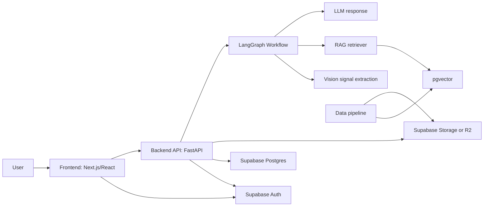

# Architecture

## 전체 흐름

## 주요 컴포넌트

- `frontend/`: 로그인/로그아웃, 식물 등록, 사진 업로드, 재배일지 입력, AI 답변 화면.
- `backend/`: 인증 검증, 사용자 데이터 API, LangGraph 실행, RAG 검색, 답변 저장.
- `data/`: 공식 문서/API 수집, 정제, 청킹, embedding 입력 데이터 생성.
- `server/`: Docker, 배포 설정, 환경변수 운영, health check, CI/CD.
- `contracts/`: 프론트와 백엔드가 공유하는 API 계약.

## 데이터 저장 기준

- 사용자 계정: Supabase Auth
- 사용자 식물/재배일지/채팅 이력: Supabase Postgres
- 사용자 업로드 사진: Supabase Storage 또는 Cloudflare R2
- 공식 문서 원본: Object Storage
- RAG chunk/embedding: Supabase Postgres + pgvector
- 로컬 개발용 임시 vector DB: Git에 커밋하지 않음

## 1차 MVP 테이블 후보

- `profiles`: 사용자 프로필
- `plants`: 사용자별 식물 프로필
- `care_logs`: 물주기, 햇빛, 증상 텍스트, 재배일지
- `plant_photos`: 업로드 사진 메타데이터
- `chat_sessions`: 식물별 상담 세션
- `chat_messages`: 사용자 질문과 AI 답변
- `rag_sources`: 공식 자료 출처
- `rag_chunks`: 검색 가능한 문서 chunk와 embedding id

## 보안 경계

- 프론트는 Supabase anon key만 사용합니다.
- Backend만 service role key 또는 server-only secret을 사용할 수 있습니다.
- Backend는 모든 요청에서 JWT를 검증하고 사용자별 row 접근을 제한합니다.
- Storage 파일 경로는 `user_id/plant_id/...` 형태로 분리합니다.
